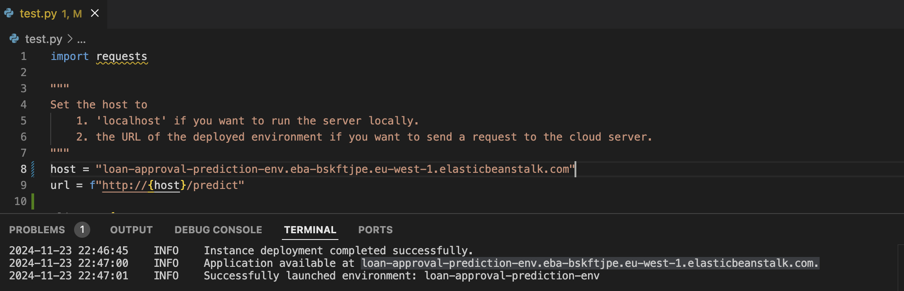

# Loan Approval Prediction

A machine learning service that predicts loan approval probability based on various applicant features. The model is trained using logistic regression and deployed as a Flask web service.

## Project Overview

This project uses a dataset containing loan application information to predict whether a loan will be approved. The model considers various factors including:

- Personal information (age, gender, education)
- Financial details (income, loan amount, loan intent)
- Credit history (credit score, previous defaults)

## Technical Stack

- Python 3.11
- Flask for API service
- scikit-learn 1.5.2 for machine learning
- Docker for containerization
- AWS Elastic Beanstalk for cloud deployment

## Model Performance

The final model achieves:
- ROC AUC Score: ~0.897 (mean across 5-fold cross-validation)
- Standard Deviation: ~0.102

## Project Structure
```
.
├── data                   # Information on dataset
├── notebook.ipynb          
├── train.py          
├── predict.py             # Flask application
├── test.py                # Send requests
├── model.bin              # Pickled model and dict vectorizer
├── Dockerfile            
├── Pipfile               
├── Pipfile.lock          
└── README.md
```
## Installation

1. Clone the repository:
~~~
git clone https://github.com/azad96/loan-approval-prediction.git
cd loan-approval-prediction
~~~

2. Install dependencies using Pipenv:
~~~
pip install pipenv
pipenv install
~~~

3. Activate the environment:
~~~
pipenv shell
~~~

## Running Locally

1. Start the Flask server:
~~~
python predict.py
~~~

2. The service will be available at `http://localhost:9696`

## API Usage

Make sure the host is set to `localhost` in test.py. Then, send POST requests to `/predict` endpoint with test.py:
~~~
python test.py
~~~

Response format:
{
'get_loan': True, 
'get_loan_prob': 0.954
}

## Docker Containerization

1. Build the image:
~~~
docker build -t loan-approval-prediction .
~~~

2. Run the container:
~~~
docker run -it --rm -p 9696:9696 loan-approval-prediction
~~~
This will start the Flask server automatically, so you can send a request with test.py

## Cloud Deployment

The project is configured for AWS Elastic Beanstalk deployment. Use the AWS EB CLI for deployment:
~~~
pipenv install --dev
eb init -p docker -r eu-west-1 loan-approval-prediction
eb create loan-approval-prediction-env --enable-spot
~~~
When the environment is launched successfully, find the line `INFO Application available at URL` in the logs of eb create command.
Copy the URL and set it as the `host` variable in test.py. Then, you can send a request by running:
~~~
python test.py
~~~


When you are done, you can terminate the environment by running:
~~~
eb terminate loan-approval-prediction-env
~~~
